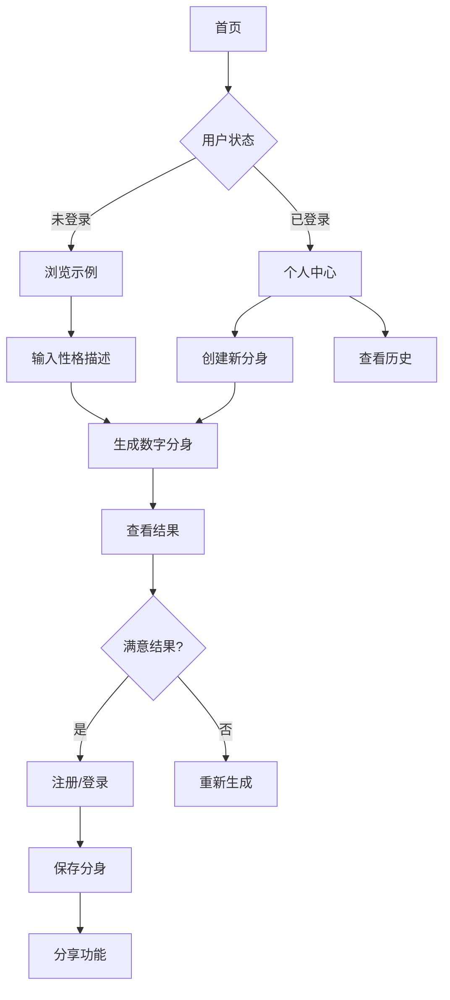

## 1. 产品概述

AI智能体数字分身平台是一个创新的AI应用，用户通过输入性格描述文字，AI能够分析并生成个性化的数字分身。这个平台帮助个人用户在网上拥有专属的AI代表，实现个性化的虚拟形象创建。

目标用户群体是希望在网上拥有AI代表的个人用户，通过简单的文字描述就能获得独特的数字分身，满足用户在虚拟世界中的个性化表达需求。

## 2. 核心功能

### 2.1 用户角色

| 角色 | 注册方式 | 核心权限 |
|------|----------|----------|
| 普通用户 | 邮箱注册 | 创建数字分身、查看历史记录、基础分享功能 |
| 访客用户 | 无需注册 | 浏览示例、体验基础功能 |

### 2.2 功能模块

我们的AI智能体数字分身平台包含以下主要页面：

1. **首页**：核心功能展示、性格输入、数字分身生成、示例展示
2. **登录/注册页**：用户身份验证、账号管理
3. **个人中心**：历史记录、已创建分身管理、个人设置
4. **分身详情页**：单个分身的详细展示、分享功能

### 2.3 页面详情

| 页面名称 | 模块名称 | 功能描述 |
|-----------|-------------|-------------|
| 首页 | 顶部导航栏 | 显示logo、主导航菜单、登录/注册按钮，响应式折叠设计 |
| 首页 | 主视觉区域 | 展示平台核心价值主张、吸引眼球的标题和副标题、主要CTA按钮 |
| 首页 | 性格输入模块 | 多行文本输入框、实时字数统计、生成按钮、输入提示、输入模式切换（直接描述/日记分析） |
| 首页 | AI生成功能 | 显示生成进度、结果预览、重新生成选项 |
| 首页 | 示例展示区域 | 轮播展示优秀分身案例、缩略图预览、点击查看详情 |
| 首页 | 特色功能介绍 | 图标化展示核心优势、简洁的功能描述 |
| 首页 | 页脚信息 | 版权声明、重要链接、社交媒体图标 |
| 登录/注册页 | 表单区域 | 邮箱/密码输入、验证码功能、第三方登录选项 |
| 个人中心 | 用户信息 | 显示头像、用户名、创建统计 |
| 个人中心 | 历史记录 | 列表展示所有创建的分身、搜索和筛选功能 |
| 分身详情页 | 分身展示 | 大图展示、详细描述、创建时间 |
| 分身详情页 | 分享功能 | 生成分享链接、社交媒体分享按钮 |

## 3. 核心流程

### 用户主要操作流程：

1. **首次访问流程**：用户进入首页 → 浏览示例和介绍 → 选择输入模式（直接描述/日记分析） → 输入文字内容 → AI分析性格特征 → 生成数字分身 → 查看结果 → 选择注册保存

2. **注册用户流程**：登录 → 进入个人中心 → 创建新分身 → 管理历史记录 → 分享分身

3. **访客体验流程**：浏览首页 → 体验生成功能 → 查看示例 → 引导注册

## 4. 用户界面设计

### 4.1 设计风格

- **主色调**：深蓝色渐变（#1e3a8a 到 #3b82f6）体现科技感
- **辅助色**：紫色渐变（#7c3aed 到 #a855f7）用于强调和交互
- **背景色**：浅灰色（#f8fafc）到白色渐变
- **按钮风格**：圆角矩形设计，悬停时有轻微阴影效果
- **字体**：主标题使用粗体无衬线字体，正文字体清晰易读
- **图标风格**：使用Lucide React图标库，线条简洁现代
- **动画效果**：页面加载淡入、按钮悬停缩放、卡片悬停上浮

### 4.2 页面设计概述

| 页面名称 | 模块名称 | UI元素 |
|-----------|-------------|-------------|
| 首页 | 顶部导航栏 | Logo居左，导航菜单居中，登录按钮居右，移动端汉堡菜单，固定定位 |
| 首页 | 主视觉区域 | 全屏渐变背景，大标题文字，副标题说明，醒目的CTA按钮，向下滚动指示器 |
| 首页 | 性格输入模块 | 卡片式布局，大输入框（300字限制），实时字数显示，渐变生成按钮 |
| 首页 | AI生成功能 | 进度条动画，结果展示卡片，包含分身图像和描述文字，操作按钮组 |
| 首页 | 示例展示区域 | 网格布局展示案例，每张卡片包含缩略图、标题、简短描述，悬停放大效果 |
| 个人中心 | 用户信息区 | 圆形头像，用户名加粗显示，创建统计卡片，简洁布局 |
| 个人中心 | 历史记录 | 时间线式布局，每张分身卡片显示缩略图、创建时间、操作按钮 |
| 分身详情页 | 主展示区域 | 大尺寸分身展示，详细描述文字，创建信息，分享按钮组 |

### 4.3 响应式设计

- **桌面端优先**：设计基准为1920x1080分辨率
- **平板适配**：768px以上使用网格布局调整
- **移动端优化**：小于768px时采用单列布局，触摸友好的按钮尺寸
- **断点设置**：640px、768px、1024px、1280px
### 4.4 新增功能：智能文本分析

#### 4.4.1 输入模式切换
- **直接描述模式**：用户直接输入性格特点关键词
- **日记分析模式**：用户分享个人日记、文章或文字表达，AI从遣词造句中分析性格特征

#### 4.4.2 日记分析功能特点
- **语言风格识别**：分析用户的用词习惯、句式结构
- **情感倾向分析**：识别文字中的情感色彩和态度
- **思维模式检测**：从表达方式推断思考模式
- **个性特征提取**：基于文字细节生成性格画像

#### 4.4.3 用户体验优化
- **输入提示**：提供日记/文章写作建议和示例
- **字数要求**：建议最少200字以获得更准确的分析结果
- **隐私保护**：明确说明用户输入内容仅用于AI分析，不会存储或分享
- **分析反馈**：展示AI分析过程和发现的关键性格特征