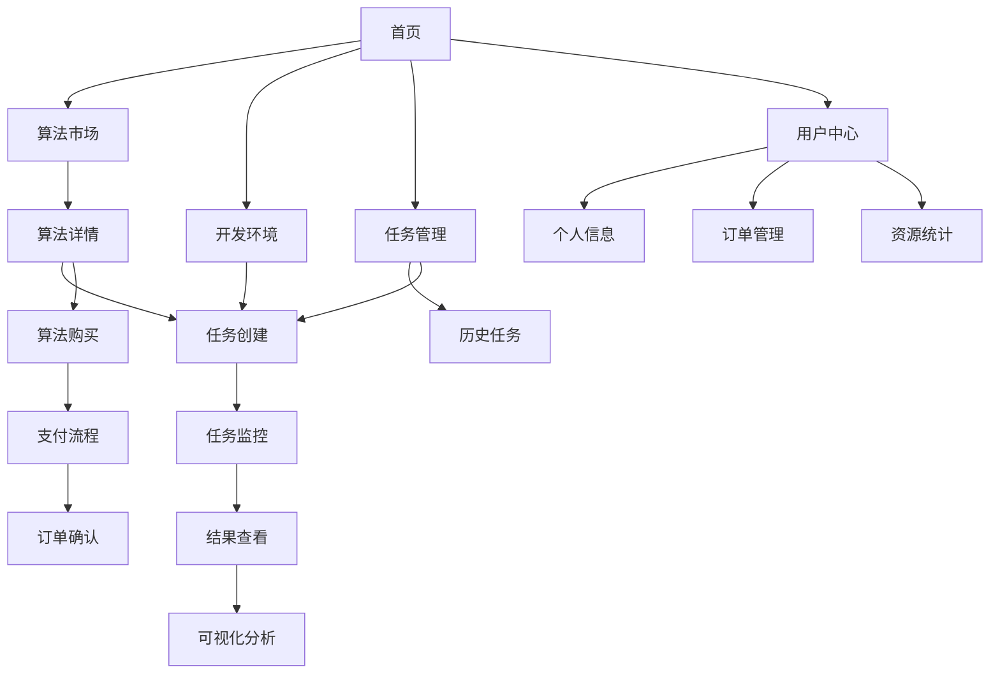

## 1. 产品概述

SaaS智能算法平台是一个面向企业级用户的云端算法服务市场，旨在为数据科学家、算法工程师和业务分析师提供一站式的算法开发、部署和管理解决方案。平台集成了丰富的算法库、可视化开发环境、自动化任务调度和智能结果分析功能，帮助用户快速构建和部署AI解决方案，降低算法应用的门槛和成本。

### 核心价值主张
- 提供即开即用的算法开发环境，支持零代码和低代码开发模式
- 构建开放的算法生态市场，促进算法资源共享和商业化
- 实现算法全生命周期管理，从开发、测试到部署和监控
- 支持弹性扩展的计算资源调度，满足不同规模业务需求

### 目标用户群体
- **数据科学家**：需要快速原型开发和算法验证
- **算法工程师**：寻求高效的算法部署和运维方案
- **业务分析师**：希望通过算法提升业务决策效率
- **企业IT部门**：需要统一的AI平台管理企业算法资产

## 2. 核心功能

### 2.1 用户角色与权限

| 角色 | 注册方式 | 核心权限 |
|------|----------|----------|
| 普通用户 | 邮箱注册 | 浏览算法市场、使用基础算法、查看个人任务 |
| 高级用户 | 付费升级 | 发布算法、创建复杂任务、使用高级计算资源 |
| 企业用户 | 企业认证 | 团队管理、私有算法库、专属计算资源 |
| 平台管理员 | 内部创建 | 全平台管理、用户审核、系统配置 |

### 2.2 功能模块概览

平台主要包含以下核心功能模块：

1. **算法市场**：算法浏览、搜索、购买和评价功能
2. **开发环境**：在线IDE、代码编辑器、调试工具
3. **任务管理**：任务创建、调度、监控和结果查看
4. **可视化分析**：结果展示、图表生成、报告导出
5. **用户中心**：个人信息、订单管理、资源使用统计
6. **系统管理**：用户管理、权限配置、系统监控

### 2.3 页面功能详述

| 页面名称 | 模块名称 | 功能描述 |
|----------|----------|----------|
| 首页 | 导航栏 | 提供平台主要功能入口，包括算法市场、开发环境、任务管理等 |
| 首页 | 轮播图 | 展示平台核心功能、热门算法和促销活动 |
| 首页 | 算法推荐 | 基于用户行为和偏好的个性化算法推荐 |
| 首页 | 统计概览 | 显示平台算法数量、用户活跃度、任务成功率等关键指标 |
| 算法市场 | 搜索筛选 | 支持多维度搜索（算法类型、应用领域、价格等）和高级筛选 |
| 算法市场 | 算法列表 | 展示算法卡片，包含名称、简介、评分、价格、使用量等信息 |
| 算法市场 | 算法详情 | 显示算法详细介绍、使用文档、示例代码、用户评价 |
| 算法市场 | 购买流程 | 支持立即购买、添加到购物车、试用申请等购买方式 |
| 开发环境 | 在线IDE | 提供基于浏览器的代码编辑器，支持Python、R等主流语言 |
| 开发环境 | 文件管理 | 支持文件上传下载、版本控制、文件夹管理 |
| 开发环境 | 调试工具 | 提供断点调试、变量监控、日志输出等调试功能 |
| 开发环境 | 依赖管理 | 支持安装第三方库、环境配置、容器化部署 |
| 任务管理 | 任务创建 | 支持选择算法、配置参数、设置输入输出路径 |
| 任务管理 | 任务调度 | 提供立即执行、定时执行、循环执行等多种调度方式 |
| 任务管理 | 任务监控 | 实时显示任务运行状态、资源使用情况、执行日志 |
| 任务管理 | 结果查看 | 展示任务执行结果、输出文件、性能指标 |
| 可视化分析 | 图表生成 | 支持多种图表类型（折线图、柱状图、散点图等） |
| 可视化分析 | 数据探索 | 提供数据预览、统计分析、特征工程工具 |
| 可视化分析 | 报告导出 | 支持生成PDF、HTML格式的分析报告 |
| 用户中心 | 个人信息 | 显示和编辑用户基本信息、联系方式、专业背景 |
| 用户中心 | 订单管理 | 查看历史订单、发票管理、退款申请 |
| 用户中心 | 资源统计 | 显示计算资源使用情况、存储空间、API调用次数 |
| 用户中心 | 消息通知 | 接收系统通知、任务完成提醒、平台公告 |

## 3. 核心业务流程

### 3.1 算法使用流程

用户从算法选择到结果获取的完整流程：

1. **算法发现**：用户通过搜索或推荐发现合适的算法
2. **算法评估**：查看算法详情、用户评价、使用示例
3. **算法获取**：购买或申请试用算法
4. **参数配置**：设置算法运行参数和输入数据
5. **任务提交**：创建并提交算法执行任务
6. **结果获取**：查看任务执行结果和可视化分析

### 3.2 算法开发流程

算法开发者发布算法的流程：

1. **环境准备**：在在线IDE中创建开发项目
2. **算法实现**：编写算法代码、添加注释文档
3. **测试验证**：运行测试用例、验证算法正确性
4. **打包发布**：将算法打包并发布到算法市场
5. **定价设置**：设置算法价格和使用条款
6. **维护更新**：根据用户反馈优化算法

### 3.3 页面导航流程

## 4. 用户界面设计

### 4.1 设计风格

- **色彩方案**：主色调采用深蓝色（#1E3A8A）体现专业性，辅以绿色（#10B981）表示成功状态，橙色（#F59E0B）用于警告和提醒
- **字体选择**：主要使用系统默认字体，标题使用加粗字体，正文字体大小为14-16px
- **布局风格**：采用卡片式布局，每个功能模块独立成卡片，便于用户理解和操作
- **图标风格**：使用简洁的线性图标，保持视觉一致性
- **交互动效**：按钮悬停效果、页面切换动画、加载状态指示器

### 4.2 页面设计详述

| 页面名称 | 模块名称 | UI设计要素 |
|----------|----------|------------|
| 首页 | 导航栏 | 固定在顶部，包含Logo、主要菜单、用户头像，背景为白色，阴影效果 |
| 首页 | 轮播图 | 全宽设计，高度400px，自动轮播，包含标题文字和CTA按钮 |
| 首页 | 算法推荐 | 网格布局，每行4个算法卡片，卡片包含图标、名称、简介、评分 |
| 算法市场 | 搜索区域 | 顶部搜索栏，支持关键词搜索，右侧高级筛选按钮 |
| 算法市场 | 侧边栏 | 左侧固定，包含分类导航、价格区间、评分筛选等 |
| 算法市场 | 算法卡片 | 白色背景，阴影效果，包含算法图标、名称、简介、标签、价格 |
| 开发环境 | 代码编辑器 | 左侧文件树，中间代码编辑区，右侧调试面板，支持主题切换 |
| 开发环境 | 工具栏 | 顶部工具栏，包含运行、调试、保存等常用操作按钮 |
| 任务管理 | 任务列表 | 表格形式展示，包含任务名称、状态、创建时间、操作按钮 |
| 任务管理 | 状态指示 | 不同状态使用不同颜色标识：运行中（蓝色）、成功（绿色）、失败（红色） |
| 可视化分析 | 图表区域 | 支持拖拽调整大小，多种图表类型切换，自定义样式设置 |
| 用户中心 | 信息卡片 | 圆形头像、用户等级徽章、个人统计信息卡片布局 |

### 4.3 响应式设计

- **桌面端优先**：主要面向桌面端用户，支持1920x1080及以上分辨率
- **平板适配**：支持768px以上宽度，采用自适应布局
- **移动端简化**：移动端仅提供核心功能，简化操作流程
- **触摸优化**：按钮和交互元素尺寸适配触摸操作

## 5. 非功能需求

### 5.1 性能要求

- **响应时间**：页面加载时间不超过3秒，API响应时间不超过500ms
- **并发支持**：支持1000个并发用户同时在线，500个并发任务执行
- **数据处理**：支持GB级别的数据上传和处理，支持流式数据处理
- **缓存机制**：静态资源缓存7天，热点数据缓存1小时

### 5.2 安全要求

- **数据加密**：用户敏感信息使用AES-256加密存储，传输过程使用HTTPS
- **访问控制**：基于角色的权限管理，支持细粒度的功能权限控制
- **审计日志**：记录所有用户操作和系统事件，保存期限不少于6个月
- **数据隔离**：不同用户的数据完全隔离，支持企业级数据隔离需求

### 5.3 可用性要求

- **服务可用性**：保证99.9%的服务可用性，年停机时间不超过8.76小时
- **故障恢复**：单点故障恢复时间不超过15分钟，数据备份恢复时间不超过1小时
- **容灾备份**：数据实时备份到异地，RPO不超过1小时，RTO不超过4小时
- **监控告警**：7x24小时系统监控，关键指标异常5分钟内告警

### 5.4 可扩展性要求

- **水平扩展**：支持通过增加服务器节点实现水平扩展
- **微服务架构**：核心功能模块化设计，支持独立部署和扩展
- **弹性伸缩**：根据负载自动调整计算资源，支持突发流量处理
- **插件机制**：支持第三方算法插件和功能模块扩展

## 6. 用户场景与用例

### 6.1 数据科学家场景

**背景**：张博士是一名数据科学家，需要快速验证一个新的机器学习算法在客户数据上的效果。

**使用流程**：
1. 登录平台后，在算法市场中搜索相关领域的算法
2. 对比不同算法的性能指标和用户评价，选择合适的算法进行试用
3. 上传自己的数据集，配置算法参数
4. 提交任务并在任务管理中监控执行进度
5. 任务完成后，使用可视化工具分析结果并生成报告
6. 根据分析结果调整参数重新运行，直到获得满意效果

### 6.2 企业业务分析师场景

**背景**：李经理是某零售企业的业务分析师，希望通过销售预测算法优化库存管理。

**使用流程**：
1. 在算法市场中寻找销售预测相关的算法
2. 申请试用并上传历史销售数据
3. 配置预测参数，如预测周期、产品类别等
4. 运行预测任务并查看结果准确性
5. 购买正式版本，设置定期自动预测任务
6. 每周查看预测报告，调整采购策略

### 6.3 算法开发者场景

**背景**：王工程师开发了一个图像识别算法，希望在平台上发布并获得收益。

**使用流程**：
1. 在开发环境中创建新项目，上传算法代码
2. 编写算法文档和使用示例
3. 进行充分的测试验证，确保算法稳定性
4. 将算法打包并发布到算法市场
5. 设置合理的价格和使用条款
6. 根据用户反馈持续优化算法，提升销量

## 7. 技术约束

### 7.1 开发技术要求

- **前端技术**：使用React 18+框架，配合TypeScript进行开发
- **后端技术**：采用Node.js + Express框架，支持微服务架构
- **数据库**：使用PostgreSQL作为主数据库，Redis作为缓存数据库
- **消息队列**：使用RabbitMQ处理异步任务和消息通知

### 7.2 部署环境要求

- **容器化部署**：使用Docker容器化部署，支持Kubernetes编排
- **云服务支持**：支持AWS、阿里云、腾讯云等主流云平台
- **CDN加速**：静态资源使用CDN加速，提升全球访问速度
- **负载均衡**：支持Nginx或云服务商负载均衡器

### 7.3 第三方服务集成

- **支付服务**：集成支付宝、微信支付、银联等支付渠道
- **存储服务**：支持阿里云OSS、AWS S3等对象存储服务
- **监控服务**：集成Prometheus + Grafana监控系统
- **日志服务**：使用ELK（Elasticsearch + Logstash + Kibana）日志方案
- **AI服务**：支持集成百度AI、腾讯AI、阿里云AI等第三方AI能力