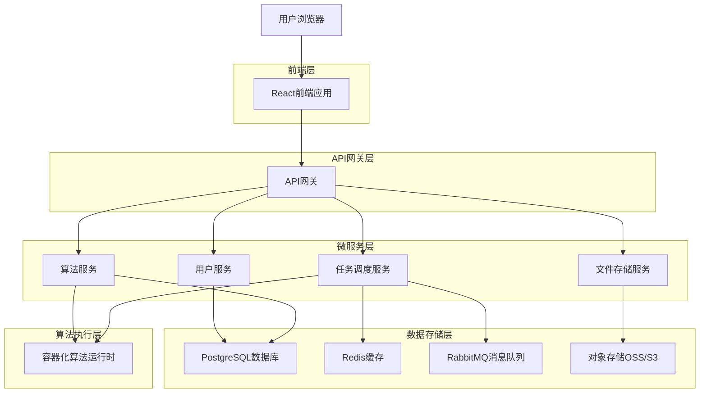
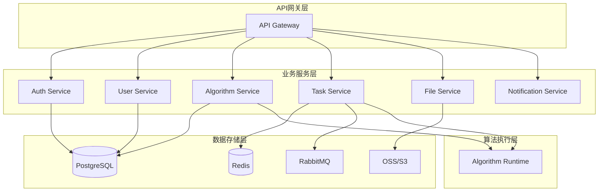
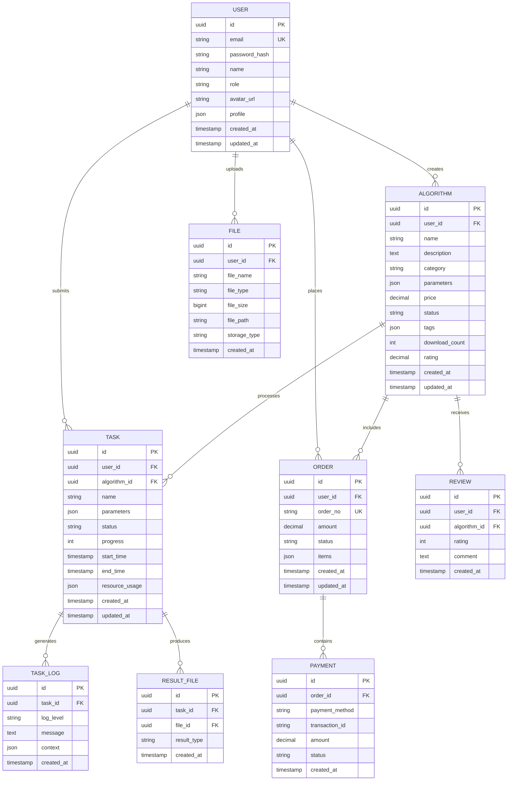

## 1. 架构设计

### 1.1 整体架构



### 1.2 技术架构说明

采用微服务架构设计，将不同功能模块解耦，支持独立部署和扩展。前端使用React框架构建单页应用，通过API网关统一访问后端服务。后端采用微服务架构，包括用户服务、算法服务、任务调度服务等核心模块。

## 2. 技术栈描述

### 2.1 前端技术栈
- **框架**：React 18.2.0 + TypeScript 5.0
- **状态管理**：Redux Toolkit + RTK Query
- **UI组件库**：Ant Design 5.0 + Tailwind CSS 3.0
- **代码编辑器**：Monaco Editor（VS Code核心）
- **图表库**：Apache ECharts + D3.js
- **构建工具**：Vite 4.0
- **测试框架**：Jest + React Testing Library

### 2.2 后端技术栈
- **运行时**：Node.js 18 LTS
- **Web框架**：Express.js 4.18 + TypeScript 5.0
- **API文档**：Swagger/OpenAPI 3.0
- **数据库ORM**：Prisma 4.0
- **认证授权**：JWT + Passport.js
- **文件上传**：Multer + Sharp（图片处理）

### 2.3 数据存储
- **主数据库**：PostgreSQL 15（用户数据、算法元数据、任务记录）
- **缓存数据库**：Redis 7.0（会话缓存、热点数据、任务队列）
- **对象存储**：阿里云OSS/AWS S3（算法文件、数据集、结果文件）
- **搜索引擎**：Elasticsearch 8.0（算法搜索、日志分析）

### 2.4 基础设施
- **容器化**：Docker + Docker Compose
- **容器编排**：Kubernetes 1.25+
- **反向代理**：Nginx 1.24
- **监控告警**：Prometheus + Grafana
- **日志收集**：ELK Stack（Elasticsearch + Logstash + Kibana）
- **链路追踪**：Jaeger

## 3. 路由定义

### 3.1 前端路由

| 路由路径 | 页面组件 | 权限要求 | 描述 |
|----------|----------|----------|------|
| / | HomePage | 公开 | 平台首页，展示推荐算法和统计数据 |
| /market | AlgorithmMarket | 公开 | 算法市场，浏览和搜索算法 |
| /market/:id | AlgorithmDetail | 公开 | 算法详情页面 |
| /develop | DevelopmentEnvironment | 登录用户 | 在线开发环境 |
| /tasks | TaskManagement | 登录用户 | 任务管理页面 |
| /tasks/:id | TaskDetail | 登录用户 | 任务详情和监控 |
| /visualization | Visualization | 登录用户 | 数据可视化分析 |
| /profile | UserProfile | 登录用户 | 用户个人信息 |
| /orders | OrderManagement | 登录用户 | 订单管理页面 |
| /admin/users | UserAdmin | 管理员 | 用户管理后台 |
| /admin/algorithms | AlgorithmAdmin | 管理员 | 算法管理后台 |
| /login | Login | 公开 | 用户登录页面 |
| /register | Register | 公开 | 用户注册页面 |
| /forgot-password | ForgotPassword | 公开 | 密码重置页面 |

### 3.2 API路由前缀

- `/api/v1/auth/*` - 认证授权相关API
- `/api/v1/users/*` - 用户管理相关API
- `/api/v1/algorithms/*` - 算法管理相关API
- `/api/v1/tasks/*` - 任务管理相关API
- `/api/v1/files/*` - 文件上传下载API
- `/api/v1/orders/*` - 订单管理相关API
- `/api/v1/analytics/*` - 统计分析相关API
- `/api/v1/admin/*` - 管理员功能API

## 4. API接口定义

### 4.1 认证授权API

#### 用户注册
```
POST /api/v1/auth/register
```

请求参数：
| 参数名 | 类型 | 必填 | 描述 |
|--------|------|------|------|
| email | string | 是 | 用户邮箱地址 |
| password | string | 是 | 用户密码（8-32位） |
| name | string | 是 | 用户姓名 |
| role | string | 否 | 用户角色（默认为"user"） |

响应示例：
```json
{
  "success": true,
  "data": {
    "user": {
      "id": "550e8400-e29b-41d4-a716-446655440000",
      "email": "user@example.com",
      "name": "张三",
      "role": "user"
    },
    "token": "eyJhbGciOiJIUzI1NiIsInR5cCI6IkpXVCJ9..."
  }
}
```

#### 用户登录
```
POST /api/v1/auth/login
```

请求参数：
| 参数名 | 类型 | 必填 | 描述 |
|--------|------|------|------|
| email | string | 是 | 用户邮箱地址 |
| password | string | 是 | 用户密码 |

### 4.2 算法管理API

#### 获取算法列表
```
GET /api/v1/algorithms
```

查询参数：
| 参数名 | 类型 | 必填 | 描述 |
|--------|------|------|------|
| page | number | 否 | 页码（默认1） |
| limit | number | 否 | 每页数量（默认20） |
| category | string | 否 | 算法分类 |
| search | string | 否 | 搜索关键词 |
| sort | string | 否 | 排序方式（price, rating, created） |

#### 创建算法
```
POST /api/v1/algorithms
```

请求参数：
| 参数名 | 类型 | 必填 | 描述 |
|--------|------|------|------|
| name | string | 是 | 算法名称 |
| description | string | 是 | 算法描述 |
| category | string | 是 | 算法分类 |
| price | number | 是 | 算法价格 |
| tags | array | 否 | 算法标签 |
| parameters | object | 是 | 算法参数配置 |
| codeFile | file | 是 | 算法代码文件 |

### 4.3 任务管理API

#### 创建任务
```
POST /api/v1/tasks
```

请求参数：
| 参数名 | 类型 | 必填 | 描述 |
|--------|------|------|------|
| algorithmId | string | 是 | 算法ID |
| name | string | 是 | 任务名称 |
| parameters | object | 是 | 任务参数 |
| inputFiles | array | 否 | 输入文件ID列表 |
| schedule | object | 否 | 调度配置 |

#### 获取任务状态
```
GET /api/v1/tasks/:id/status
```

响应示例：
```json
{
  "success": true,
  "data": {
    "id": "task-123",
    "status": "running",
    "progress": 65,
    "startTime": "2024-01-15T10:30:00Z",
    "estimatedEndTime": "2024-01-15T11:00:00Z",
    "resourceUsage": {
      "cpu": "45%",
      "memory": "2.1GB",
      "gpu": "30%"
    }
  }
}
```

## 5. 服务器架构

### 5.1 微服务架构图



### 5.2 服务职责说明

#### API网关服务
- 统一入口，路由分发
- 认证授权验证
- 限流熔断保护
- 请求日志记录
- 跨域处理

#### 用户服务
- 用户注册登录
- 用户信息管理
- 权限角色管理
- 用户行为统计

#### 算法服务
- 算法元数据管理
- 算法版本控制
- 算法分类标签
- 算法评价统计
- 算法使用统计

#### 任务服务
- 任务生命周期管理
- 任务调度执行
- 任务状态监控
- 任务结果处理
- 资源使用统计

#### 文件服务
- 文件上传下载
- 文件存储管理
- 文件权限控制
- 文件版本管理

## 6. 数据模型设计

### 6.1 核心实体关系图



### 6.2 数据库表结构

#### 用户表（users）
```sql
CREATE TABLE users (
    id UUID PRIMARY KEY DEFAULT gen_random_uuid(),
    email VARCHAR(255) UNIQUE NOT NULL,
    password_hash VARCHAR(255) NOT NULL,
    name VARCHAR(100) NOT NULL,
    role VARCHAR(20) DEFAULT 'user' CHECK (role IN ('user', 'premium', 'enterprise', 'admin')),
    avatar_url VARCHAR(500),
    profile JSONB DEFAULT '{}',
    usage_stats JSONB DEFAULT '{}',
    is_active BOOLEAN DEFAULT true,
    last_login_at TIMESTAMP WITH TIME ZONE,
    created_at TIMESTAMP WITH TIME ZONE DEFAULT NOW(),
    updated_at TIMESTAMP WITH TIME ZONE DEFAULT NOW()
);

CREATE INDEX idx_users_email ON users(email);
CREATE INDEX idx_users_role ON users(role);
CREATE INDEX idx_users_created_at ON users(created_at DESC);
```

#### 算法表（algorithms）
```sql
CREATE TABLE algorithms (
    id UUID PRIMARY KEY DEFAULT gen_random_uuid(),
    user_id UUID NOT NULL REFERENCES users(id) ON DELETE CASCADE,
    name VARCHAR(200) NOT NULL,
    description TEXT NOT NULL,
    category VARCHAR(50) NOT NULL,
    subcategory VARCHAR(50),
    parameters JSONB NOT NULL DEFAULT '{}',
    price DECIMAL(10,2) DEFAULT 0.00,
    currency VARCHAR(3) DEFAULT 'CNY',
    status VARCHAR(20) DEFAULT 'draft' CHECK (status IN ('draft', 'pending', 'approved', 'rejected', 'suspended')),
    tags TEXT[] DEFAULT '{}',
    download_count INTEGER DEFAULT 0,
    rating DECIMAL(3,2) DEFAULT 0.00,
    review_count INTEGER DEFAULT 0,
    code_file_path VARCHAR(500),
    documentation_url VARCHAR(500),
    demo_data_url VARCHAR(500),
    version VARCHAR(20) DEFAULT '1.0.0',
    requirements JSONB DEFAULT '{}',
    metadata JSONB DEFAULT '{}',
    created_at TIMESTAMP WITH TIME ZONE DEFAULT NOW(),
    updated_at TIMESTAMP WITH TIME ZONE DEFAULT NOW(),
    published_at TIMESTAMP WITH TIME ZONE
);

CREATE INDEX idx_algorithms_user_id ON algorithms(user_id);
CREATE INDEX idx_algorithms_category ON algorithms(category);
CREATE INDEX idx_algorithms_status ON algorithms(status);
CREATE INDEX idx_algorithms_price ON algorithms(price);
CREATE INDEX idx_algorithms_rating ON algorithms(rating DESC);
CREATE INDEX idx_algorithms_created_at ON algorithms(created_at DESC);
CREATE INDEX idx_algorithms_tags ON algorithms USING GIN(tags);
```

#### 任务表（tasks）
```sql
CREATE TABLE tasks (
    id UUID PRIMARY KEY DEFAULT gen_random_uuid(),
    user_id UUID NOT NULL REFERENCES users(id) ON DELETE CASCADE,
    algorithm_id UUID NOT NULL REFERENCES algorithms(id) ON DELETE CASCADE,
    name VARCHAR(200) NOT NULL,
    description TEXT,
    parameters JSONB NOT NULL DEFAULT '{}',
    input_files UUID[] DEFAULT '{}',
    output_files UUID[] DEFAULT '{}',
    status VARCHAR(20) DEFAULT 'pending' CHECK (status IN ('pending', 'queued', 'running', 'completed', 'failed', 'cancelled')),
    priority INTEGER DEFAULT 5 CHECK (priority >= 1 AND priority <= 10),
    progress INTEGER DEFAULT 0 CHECK (progress >= 0 AND progress <= 100),
    start_time TIMESTAMP WITH TIME ZONE,
    end_time TIMESTAMP WITH TIME ZONE,
    estimated_duration INTEGER,
    actual_duration INTEGER,
    resource_usage JSONB DEFAULT '{}',
    error_message TEXT,
    retry_count INTEGER DEFAULT 0,
    max_retries INTEGER DEFAULT 3,
    schedule_config JSONB DEFAULT '{}',
    execution_config JSONB DEFAULT '{}',
    cost DECIMAL(10,2) DEFAULT 0.00,
    created_at TIMESTAMP WITH TIME ZONE DEFAULT NOW(),
    updated_at TIMESTAMP WITH TIME ZONE DEFAULT NOW()
);

CREATE INDEX idx_tasks_user_id ON tasks(user_id);
CREATE INDEX idx_tasks_algorithm_id ON tasks(algorithm_id);
CREATE INDEX idx_tasks_status ON tasks(status);
CREATE INDEX idx_tasks_created_at ON tasks(created_at DESC);
CREATE INDEX idx_tasks_start_time ON tasks(start_time);
```

#### 文件表（files）
```sql
CREATE TABLE files (
    id UUID PRIMARY KEY DEFAULT gen_random_uuid(),
    user_id UUID NOT NULL REFERENCES users(id) ON DELETE CASCADE,
    original_name VARCHAR(255) NOT NULL,
    file_name VARCHAR(255) NOT NULL,
    file_type VARCHAR(100) NOT NULL,
    file_size BIGINT NOT NULL,
    file_path VARCHAR(500) NOT NULL,
    storage_type VARCHAR(20) DEFAULT 'local' CHECK (storage_type IN ('local', 'oss', 's3', 'cos')),
    mime_type VARCHAR(100),
    checksum VARCHAR(64),
    metadata JSONB DEFAULT '{}',
    is_public BOOLEAN DEFAULT false,
    download_count INTEGER DEFAULT 0,
    expires_at TIMESTAMP WITH TIME ZONE,
    created_at TIMESTAMP WITH TIME ZONE DEFAULT NOW(),
    updated_at TIMESTAMP WITH TIME ZONE DEFAULT NOW()
);

CREATE INDEX idx_files_user_id ON files(user_id);
CREATE INDEX idx_files_file_type ON files(file_type);
CREATE INDEX idx_files_created_at ON files(created_at DESC);
CREATE INDEX idx_files_storage_type ON files(storage_type);
```

### 6.3 初始数据

```sql
-- 插入默认管理员用户
INSERT INTO users (email, password_hash, name, role) VALUES 
('admin@example.com', '$2b$10$92IXUNpkjO0rOQ5byMi.Ye4oKoEa3Ro9llC/.og/at2.uheWG/igi', '系统管理员', 'admin');

-- 插入算法分类数据
INSERT INTO algorithms (user_id, name, description, category, price, status, tags) VALUES
('550e8400-e29b-41d4-a716-446655440000', '线性回归算法', '经典的线性回归算法，适用于连续值预测问题', '机器学习', 0.00, 'approved', '{"回归", "预测", "基础"}'),
('550e8400-e29b-41d4-a716-446655440000', 'K-means聚类', '无监督学习聚类算法，用于数据分组', '机器学习', 0.00, 'approved', '{"聚类", "无监督学习", "分类"}'),
('550e8400-e29b-41d4-a716-446655440000', '图像识别CNN', '基于卷积神经网络的图像识别算法', '深度学习', 99.00, 'approved', '{"CNN", "图像识别", "深度学习"}');

-- 设置权限
GRANT SELECT ON ALL TABLES TO anon;
GRANT ALL PRIVILEGES ON ALL TABLES TO authenticated;
```

## 7. 部署架构

### 7.1 容器化部署

#### Dockerfile示例（前端）
```dockerfile
# 构建阶段
FROM node:18-alpine as builder
WORKDIR /app
COPY package*.json ./
RUN npm ci --only=production
COPY . .
RUN npm run build

# 生产阶段
FROM nginx:alpine
COPY --from=builder /app/dist /usr/share/nginx/html
COPY nginx.conf /etc/nginx/nginx.conf
EXPOSE 80
CMD ["nginx", "-g", "daemon off;"]
```

#### Dockerfile示例（后端）
```dockerfile
FROM node:18-alpine
WORKDIR /app
COPY package*.json ./
RUN npm ci --only=production
COPY . .
RUN npm run build
EXPOSE 3000
CMD ["node", "dist/index.js"]
```

### 7.2 Kubernetes部署配置

```yaml
apiVersion: apps/v1
kind: Deployment
metadata:
  name: algorithm-platform-api
spec:
  replicas: 3
  selector:
    matchLabels:
      app: algorithm-platform-api
  template:
    metadata:
      labels:
        app: algorithm-platform-api
    spec:
      containers:
      - name: api
        image: algorithm-platform/api:latest
        ports:
        - containerPort: 3000
        env:
        - name: DATABASE_URL
          valueFrom:
            secretKeyRef:
              name: database-secret
              key: url
        - name: REDIS_URL
          valueFrom:
            secretKeyRef:
              name: redis-secret
              key: url
        resources:
          requests:
            memory: "512Mi"
            cpu: "250m"
          limits:
            memory: "1Gi"
            cpu: "500m"
---
apiVersion: v1
kind: Service
metadata:
  name: algorithm-platform-api-service
spec:
  selector:
    app: algorithm-platform-api
  ports:
  - protocol: TCP
    port: 80
    targetPort: 3000
  type: ClusterIP
```

## 8. 性能优化

### 8.1 前端优化
- **代码分割**：使用React.lazy和Suspense实现路由级代码分割
- **图片优化**：使用WebP格式，支持懒加载和响应式图片
- **缓存策略**：静态资源使用强缓存，API响应使用协商缓存
- **CDN加速**：静态资源部署到CDN，提升全球访问速度

### 8.2 后端优化
- **数据库优化**：建立合适的索引，使用连接池，实现读写分离
- **缓存策略**：Redis缓存热点数据，减少数据库查询
- **异步处理**：使用消息队列处理耗时操作，提升响应速度
- **连接复用**：HTTP连接池，数据库连接池复用

### 8.3 算法执行优化
- **容器预热**：预启动算法执行容器，减少冷启动时间
- **资源池化**：建立算法执行资源池，复用计算资源
- **智能调度**：根据算法特性和资源需求智能调度任务
- **并行处理**：支持多任务并行执行，提升整体吞吐量